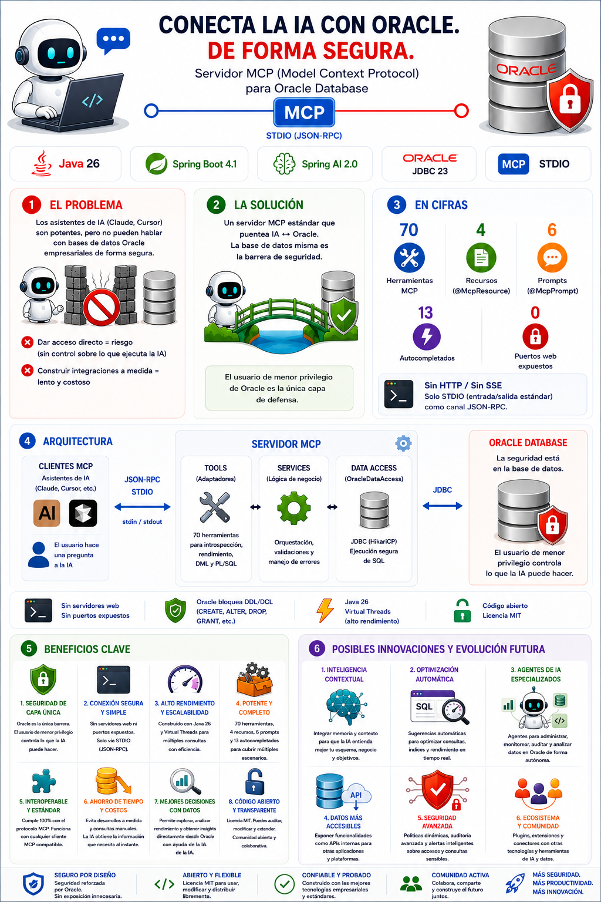
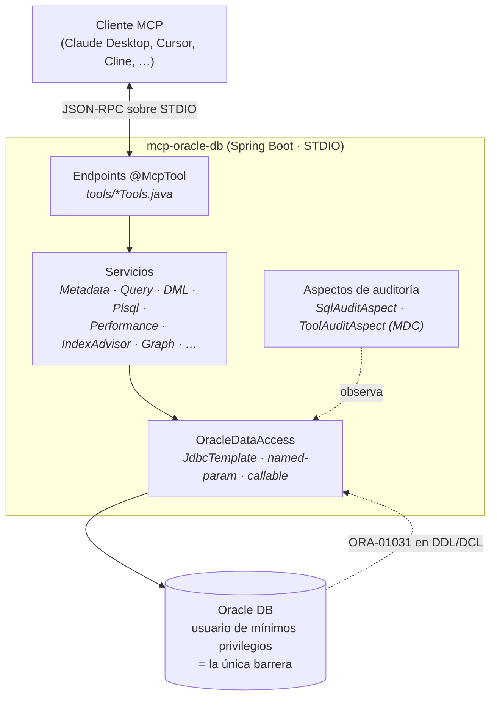

<div align="center">

[English](README.md) | [Español](README.es.md)

# mcp-oracle-db

Un servidor [MCP](https://modelcontextprotocol.io) para **Oracle Database**,
construido con Spring Boot y Spring AI.

[](https://opensource.org/licenses/MIT)
[](https://openjdk.org/)
[](https://spring.io/projects/spring-boot)
[](https://spring.io/projects/spring-ai)
[](https://www.oracle.com/database/)
[](https://modelcontextprotocol.io)
[](https://github.com/zademy/mcp-oracle-db/commits/main)
[](https://github.com/zademy/mcp-oracle-db/stargazers)

Permite que cualquier cliente compatible con MCP (Claude Desktop, Cursor, Cline,
Continue, VS Code, Windsurf, …) **introspecte** un esquema de Oracle y **ejecute
SQL** — de forma segura.

</div>

<p align="center">
  <a href="images/info_es.png"></a>
</p>

---

## ¿Por qué mcp-oracle-db?

- **Seguro por diseño** — la única barrera de seguridad es un **usuario de Oracle
  de mínimos privilegios**. No hay filtro de SQL en la aplicación; el propio
  Oracle rechaza cada `CREATE`/`ALTER`/`DROP`/`GRANT`/… con `ORA-01031`.
- **70 herramientas** de introspección de esquema, diagnóstico de rendimiento,
  asesoría de índices/consultas, utilidades de datos, DML, explain plan, grafos
  de esquema, PL/SQL y sistema.
- **Sin puerto web** — solo transporte STDIO. Nunca se expone un servidor
  HTTP/SSE.
- **Virtual threads** — hilos virtuales de Java 26, ideales para JDBC bloqueante.
- **Sin secretos en el repositorio** — las credenciales provienen de variables
  de entorno.

**¿Para quién?** DBAs, desarrolladores backend y flujos asistidos por IA que
necesitan un acompañante Oracle local y orientado a lectura: explorar un esquema,
diagnosticar rendimiento, previsualizar DML y dejar que un LLM ejecute SQL
ad-hoc sin poner en riesgo la estructura de la base.

## Qué hace

**Ejecutado**

- Lecturas de esquema — metadatos, DDL, código fuente PL/SQL, secuencias,
  restricciones, particiones, diagnóstico de rendimiento vía vistas `V$`.
- DML — `INSERT`, `UPDATE`, `DELETE`, `MERGE` sobre tablas existentes.
- Invocación de PL/SQL — `call_procedure` (requiere `GRANT EXECUTE` sobre el
  objeto).
- Comentarios de metadatos — `COMMENT ON ...`.

**Rechazado por Oracle** (el usuario de mínimos privilegios no tiene privilegios
DDL/DCL)

- Todo DDL estructural — todas las formas de `CREATE ...`, `ALTER`, `DROP`,
  `TRUNCATE`, `RENAME`.
- Todo DCL — `GRANT`, `REVOKE`, `PURGE`, `FLASHBACK`, `LOCK TABLE`, `AUDIT`,
  `NOAUDIT`, `ANALYZE`.

## Tabla de contenidos

- [¿Por qué mcp-oracle-db?](#por-qué-mcp-oracle-db)
- [Qué hace](#qué-hace)
- [Requisitos](#requisitos)
- [Inicio rápido](#inicio-rápido)
  - [1. Crea el usuario de Oracle de mínimos privilegios](#1-crea-el-usuario-de-oracle-de-mínimos-privilegios)
  - [2. Configura las credenciales (variables de entorno)](#2-configura-las-credenciales-variables-de-entorno)
  - [3. Compila](#3-compila)
  - [4. Conecta tu cliente MCP (STDIO)](#4-conecta-tu-cliente-mcp-stdio)
  - [Primera sesión rápida](#primera-sesión-rápida)
- [Configuración de clientes MCP](#configuración-de-clientes-mcp)
- [Referencia de configuración](#referencia-de-configuración)
- [Auditoría SQL](#auditoría-sql)
- [Arquitectura](#arquitectura)
- [Referencia de herramientas](#referencia-de-herramientas)
- [Modelo de seguridad](#modelo-de-seguridad)
- [Pruebas](#pruebas)
- [Resolución de problemas y preguntas frecuentes](#resolución-de-problemas-y-preguntas-frecuentes)
- [Limitaciones y notas](#limitaciones-y-notas)
- [Contribuir y flujo de agentes](#contribuir-y-flujo-de-agentes)
- [Licencia](#licencia)

## Requisitos

- **JDK 26**
- **Apache Maven 3.9+** (alcanza con el wrapper `mvnw` incluido)
- **Oracle Database 12c+** (probado con drivers 19c / 23ai)
- Un **cliente MCP** que hable STDIO (Claude Desktop, Cursor, Cline, Continue,
  VS Code, Windsurf, …)

## Inicio rápido

### 1. Crea el usuario de Oracle de mínimos privilegios

Ejecuta `db/setup_least_privilege_user.sql` como DBA. Edita primero los
marcadores `&`.

```bash
# Linux / macOS
sqlplus system/<contraseña-dba>@//<host>:1521/<servicio> @db/setup_least_privilege_user.sql
```

```cmd
:: Windows (cmd / PowerShell)
sqlplus system/<contraseña-dba>@//<host>:1521/<servicio> @db\setup_least_privilege_user.sql
```

Crea un usuario con `CREATE SESSION`, `SELECT_CATALOG_ROLE` y privilegios
`SELECT`/`INSERT`/`UPDATE`/`DELETE` por objeto sobre las tablas del esquema
objetivo (además de `SELECT` sobre vistas y secuencias). Otorga deliberadamente
**sin** DDL y **sin** cuota de tablespace.

### 2. Configura las credenciales (variables de entorno)

| Variable             | Significado                                           | Ejemplo                                     |
| -------------------- | ----------------------------------------------------- | ------------------------------------------- |
| `ORACLE_DB_URL`      | URL JDBC thin                                         | `jdbc:oracle:thin:@//db.host:1521/ORCLPDB1` |
| `ORACLE_DB_USERNAME` | Usuario de mínimos privilegios del paso 1             | `mcp_user`                                  |
| `ORACLE_DB_PASSWORD` | Contraseña de ese usuario                             | `s3cret`                                    |
| `ORACLE_POOL_SIZE`   | Tamaño máx. del pool HikariCP (opcional, default `7`) | `7`                                         |

> **¿Qué esquema usa el servidor?** No existe un ajuste `schema`. En Oracle el
> esquema equivale al usuario conectado, así que el esquema por defecto es el
> `ORACLE_DB_USERNAME` que configures. Como el servidor introspecta a través de
> las vistas `ALL_*`, puede ver **cualquier** esquema donde ese usuario tenga
> privilegios — pasa el esquema deseado como parámetro de la herramienta (p. ej.
> `list_tables(schema="HR")`). Qué esquemas son visibles se controla
> totalmente con los privilegios de `db/setup_least_privilege_user.sql`.

### 3. Compila

```bash
# Linux / macOS
./mvnw clean package -DskipTests
```

```powershell
# Windows (PowerShell)
.\mvnw.cmd clean package -DskipTests
```

Esto produce `target/mcp-oracle-db-0.0.1-SNAPSHOT.jar` (jar ejecutable de Spring
Boot).

### 4. Conecta tu cliente MCP (STDIO)

El bloque JSON mostrado abajo es el estándar de facto usado por Claude Desktop,
Cursor, Cline, Windsurf y Continue. Consulta
[Configuración de clientes MCP](#configuración-de-clientes-mcp) para la ruta
exacta del archivo según el cliente.

```json
{
  "mcpServers": {
    "oracle-db": {
      "command": "/ruta/hacia/jdk/bin/java",
      "args": ["-jar", "/ruta/absoluta/mcp-oracle-db-0.0.1-SNAPSHOT.jar"],
      "env": {
        "ORACLE_DB_URL": "jdbc:oracle:thin:@//db.host:1521/ORCLPDB1",
        "ORACLE_DB_USERNAME": "mcp_user",
        "ORACLE_DB_PASSWORD": "s3cret"
      }
    }
  }
}
```

Reinicia el cliente tras guardar. Verifica con la herramienta `test_connection`,
que reporta la versión, nombre, usuario actual, esquema actual e instancia.

### Primera sesión rápida

Una vez que el cliente muestre el servidor conectado, prueba en este orden:

1. **`test_connection`** — confirma conectividad y el usuario/esquema conectado.
2. **`list_tables(schema="HR")`** — ve las tablas a las que tienes acceso.
3. **`describe_table(schema="HR", table="EMPLOYEES")`** — columnas, tipos, nulabilidad.
4. **`get_sample_data(schema="HR", table="EMPLOYEES")`** — primeras N filas, sin riesgo.
5. **`run_query(sql="SELECT department_id, COUNT(*) FROM \"HR\".\"EMPLOYEES\" GROUP BY department_id")`**
   — SQL ad-hoc, acotado por `max-rows`.

## Configuración de clientes MCP

Todos los clientes STDIO comparten el mismo bloque de servidor mostrado en el
[paso 4](#4-conecta-tu-cliente-mcp-stdio). Solo difieren en **dónde** se lee
ese bloque:

| Cliente                   | Archivo de configuración                                                                                                        | Clave / notas                           |
| ------------------------- | ------------------------------------------------------------------------------------------------------------------------------- | --------------------------------------- |
| **Claude Desktop**        | macOS `~/Library/Application Support/Claude/claude_desktop_config.json` · Windows `%APPDATA%\Claude\claude_desktop_config.json` | `"mcpServers"`                          |
| **Cursor**                | `.cursor/mcp.json` (proyecto) o `~/.cursor/mcp.json` (global)                                                                   | `"mcpServers"`                          |
| **Cline** (VS Code)       | `…/globalStorage/saoudrizwan.claude-dev/settings/cline_mcp_settings.json`                                                       | `"mcpServers"`, pon `"disabled": false` |
| **Windsurf**              | `~/.codeium/windsurf/mcp_config.json` (Windows: `%USERPROFILE%\.codeium\windsurf\mcp_config.json`)                              | `"mcpServers"`                          |
| **Continue**              | `~/.continue/config.yaml` (o `.continue/config.json` en el repo)                                                                | `"mcpServers"`                          |
| **VS Code** (MCP, 1.102+) | `.vscode/mcp.json` en el workspace                                                                                              | usa `"servers"` con `"type": "stdio"`   |

> Las rutas pueden cambiar entre versiones del cliente — ante la duda, revisa la
> documentación del cliente. Lo importante es que el bloque `command` / `args` /
> `env` es idéntico para todos.

**Nota de VS Code** — su esquema usa `servers` en lugar de `mcpServers`, y cada
entrada requiere `"type": "stdio"`:

```json
{
  "servers": {
    "oracle-db": {
      "type": "stdio",
      "command": "/ruta/hacia/jdk/bin/java",
      "args": ["-jar", "/ruta/absoluta/mcp-oracle-db-0.0.1-SNAPSHOT.jar"],
      "env": {
        "ORACLE_DB_URL": "jdbc:oracle:thin:@//db.host:1521/ORCLPDB1",
        "ORACLE_DB_USERNAME": "mcp_user",
        "ORACLE_DB_PASSWORD": "s3cret"
      }
    }
  }
}
```

## Referencia de configuración

El ajuste opcional vive en `application.yaml` bajo `oracle.mcp`:

| Propiedad               | Significado                                   | Default |
| ----------------------- | --------------------------------------------- | ------- |
| `max-rows`              | Tope global de filas que devuelve un `SELECT` | `1000`  |
| `query-timeout-seconds` | Timeout por sentencia                         | `120`   |
| `default-sample-rows`   | Filas que devuelve `get_sample_data`          | `10`    |

Niveles de log vía `LOG_LEVEL` (default `WARN`) y `APP_LOG_LEVEL` (default
`INFO`). Ten en cuenta que **stdout es el canal JSON-RPC** — los logs van a
stderr/archivo, nunca a stdout.

### Auditoría SQL

Auditoría SQL opcional por sesión. Si se activa, cada sentencia SQL que llega a
Oracle se añade a un archivo `.txt` — un archivo por sesión.

| Variable            | Significado                                         | Default            |
| ------------------- | --------------------------------------------------- | ------------------ |
| `MCP_AUDIT_ENABLED` | Activar el subsistema de auditoría (`true`/`false`) | `false`            |
| `MCP_AUDIT_DIR`     | Directorio para los archivos de auditoría           | `./mcp-audit-logs` |

#### Activarlo en tu cliente MCP

Añade las dos variables al bloque `env` de tu entrada del servidor MCP — es el
único lugar que debes tocar. Ejemplo para Claude Desktop / Cursor
(`claude_desktop_config.json` o `.cursor/mcp.json`):

```json
{
  "mcpServers": {
    "oracle-db": {
      "command": "/ruta/hacia/jdk/bin/java",
      "args": ["-jar", "/ruta/absoluta/mcp-oracle-db-0.0.1-SNAPSHOT.jar"],
      "env": {
        "ORACLE_DB_URL": "jdbc:oracle:thin:@//db.host:1521/ORCLPDB1",
        "ORACLE_DB_USERNAME": "mcp_user",
        "ORACLE_DB_PASSWORD": "s3cret",
        "MCP_AUDIT_ENABLED": "true",
        "MCP_AUDIT_DIR": "/var/log/mcp-oracle-db"
      }
    }
  }
}
```

Tras guardar, **reinicia el cliente** para que relance el servidor MCP con el
nuevo entorno. Se crea entonces un `.txt` por sesión en `MCP_AUDIT_DIR`, añadido
en cada SQL que el servidor lanza contra Oracle.

Para validar rápido sin el cliente, ejecuta el jar directamente:

```bash
# Linux / macOS
MCP_AUDIT_ENABLED=true MCP_AUDIT_DIR=./mcp-audit-logs \
ORACLE_DB_URL=jdbc:oracle:thin:@//host:1521/SVC \
ORACLE_DB_USERNAME=mcp_user ORACLE_DB_PASSWORD=... \
java -jar target/mcp-oracle-db-0.0.1-SNAPSHOT.jar
```

```powershell
# Windows (PowerShell) — define las variables en la misma shell y luego lanza
$env:MCP_AUDIT_ENABLED="true"; $env:MCP_AUDIT_DIR="./mcp-audit-logs"
$env:ORACLE_DB_URL="jdbc:oracle:thin:@//host:1521/SVC"
$env:ORACLE_DB_USERNAME="mcp_user"; $env:ORACLE_DB_PASSWORD="..."
java -jar target/mcp-oracle-db-0.0.1-SNAPSHOT.jar
```

Formato del nombre: `<serverName>-<dd-MM-yyyy>-<sessionId8>-log.txt`.

Cada entrada registra la herramienta, parámetros, texto SQL, resultado, filas y
duración:

```
===== 2026-06-27T14:30:52.884 =====================================
tool     : get_sample_data
params   : schema=HR, table=EMPLOYEES, rows=10
kind     : Select
type     : READ
sql      : SELECT * FROM "HR"."EMPLOYEES" FETCH FIRST 10 ROWS ONLY
outcome  : OK
rows     : 10
duration : 23 ms
-------------------------------------------------------------------
```

**Notas:**

- Los archivos de auditoría contienen texto SQL **incluyendo literales y valores
  de parámetros** — protege el directorio de auditoría.
- Desactivado por defecto; cero overhead cuando está apagado (sin archivos, sin
  I/O).
- Compatible con STDIO — escribe solo al sistema de archivos, nunca a stdout.

## Arquitectura

Capas estrictas. Las dependencias apuntan hacia adentro (tools → services →
persistence). Un aspecto de auditoría observa cada SQL que llega a
`OracleDataAccess` sin alterar el texto SQL ni los resultados.



## Referencia de herramientas

**70 herramientas**, agrupadas por categoría. _Solo lectura_ nunca modifica
datos; _escritura_ se ejecuta en la base.

### Introspección de esquema _(solo lectura)_

| Herramienta         | Descripción                                                                                                                                                                                                                                                                                                        |
| ------------------- | ------------------------------------------------------------------------------------------------------------------------------------------------------------------------------------------------------------------------------------------------------------------------------------------------------------------ |
| `list_schemas`      | Lista todos los esquemas (usuarios) de Oracle visibles para la conexión actual.                                                                                                                                                                                                                                    |
| `list_tables`       | Lista tablas; esquema opcional y patrón LIKE de nombre no sensible a mayúsculas (default `%`).                                                                                                                                                                                                                     |
| `list_views`        | Lista vistas; esquema opcional y patrón LIKE.                                                                                                                                                                                                                                                                      |
| `describe_table`    | Columnas de una tabla: nombre, tipo, nulabilidad, valor por defecto y comentario. Llámala antes de un SELECT/INSERT/UPDATE sobre una tabla no verificada.                                                                                                                                                          |
| `list_indexes`      | Índices de una tabla con sus columnas, unicidad y estado.                                                                                                                                                                                                                                                          |
| `list_constraints`  | Restricciones de una tabla (PK, FK, unique, check) con columnas y referencias.                                                                                                                                                                                                                                     |
| `list_sequences`    | Secuencias con rango, incremento, último número, flag de ciclo y cache (de `ALL_SEQUENCES`, no `DBA_SEQUENCES`). Esquema opcional.                                                                                                                                                                                 |
| `get_sequence_info` | Metadatos de una secuencia (rango, incremento, último número, flags cache/order) de `ALL_SEQUENCES`. Solo lectura: NO consume `NEXTVAL`.                                                                                                                                                                           |
| `table_exists`      | `true` si una tabla existe (vía `ALL_TABLES`; las vistas no cuentan). Úsala en lugar de `run_query {SELECT 1 FROM ALL_TABLES ...}`.                                                                                                                                                                                |
| `list_triggers`     | Triggers con tipo, evento disparador, tabla objetivo y estado. Esquema opcional.                                                                                                                                                                                                                                   |
| `list_objects`      | Objetos de la base; esquema opcional y filtro por tipo de objeto.                                                                                                                                                                                                                                                  |
| `search_objects`    | Busca objetos por patrón LIKE de nombre no sensible a mayúsculas; filtro de tipo opcional.                                                                                                                                                                                                                         |
| `get_ddl`           | DDL de un objeto vía `DBMS_METADATA`. Los 3 parámetros son obligatorios (`schema`, `name`, `type`); solo lectura. Tipos: TABLE, VIEW, INDEX, SEQUENCE, PROCEDURE, FUNCTION, PACKAGE, PACKAGE BODY, TRIGGER, TYPE, SYNONYM, DB LINK.                                                                                |
| `describe_plsql`    | Un objeto PL/SQL: sus argumentos y código fuente completo.                                                                                                                                                                                                                                                         |
| `call_procedure`    | _(escritura)_ Ejecuta un procedimiento, función o subprograma de package PL/SQL con argumentos tipados IN/OUT/INOUT; soporta un `SYS_REFCURSOR` OUT/return y valores de retorno de función. PL/SQL BOOLEAN/RECORD/TABLE/VARRAY/OBJECT se rechazan con guía de envoltura. Requiere `GRANT EXECUTE` sobre el objeto. |

### Introspección extendida _(solo lectura)_

| Herramienta               | Descripción                                                                                    |
| ------------------------- | ---------------------------------------------------------------------------------------------- |
| `list_materialized_views` | Vistas materializadas con modo y método de refresco, último refresco y obsolescencia.          |
| `list_mview_logs`         | Logs de vistas materializadas definidos sobre tablas. Esquema opcional.                        |
| `list_synonyms`           | Sinónimos privados y públicos con su objetivo resuelto y DB link.                              |
| `list_partitions`         | Particiones de una tabla particionada (nombre, posición, high value, filas, compresión).       |
| `list_subpartitions`      | Subparticiones de una tabla con particionamiento compuesto.                                    |
| `list_ind_partitions`     | Particiones de índices de una tabla (estado, bloques hoja, claves distintas).                  |
| `list_db_links`           | Database links visibles para el usuario actual.                                                |
| `list_procedures`         | Procedimientos, funciones, packages y tipos almacenados; filtros opcionales.                   |
| `list_types`              | Tipos definidos por el usuario con typecode, atributos, métodos y supertipo.                   |
| `list_dependencies`       | Objetos de los que depende un objeto dado (útil para análisis de impacto).                     |
| `list_invalid_objects`    | Objetos cuyo estado es Invalid (código roto que hay que recompilar).                           |
| `list_external_tables`    | Tablas externas con driver de acceso, directorio, reject limit y parámetros.                   |
| `list_directories`        | Objetos directorio de Oracle y sus rutas en el sistema de archivos.                            |
| `list_lob_columns`        | Columnas LOB con segmento, caché, flag SECUREFILE y retención.                                 |
| `list_scheduler_jobs`     | Jobs de `DBMS_SCHEDULER` con estado, conteos de ejecución/fallo, próxima ejecución, intervalo. |
| `list_scheduler_job_runs` | Detalles recientes de ejecución de jobs `DBMS_SCHEDULER`: estado, duración, código de error.   |

### PL/SQL y estadísticas del optimizador _(solo lectura)_

| Herramienta         | Descripción                                                                                 |
| ------------------- | ------------------------------------------------------------------------------------------- |
| `get_plsql_errors`  | Errores de compilación de unidades PL/SQL. Crítico para diagnosticar código roto.           |
| `get_table_stats`   | Estadísticas del optimizador de una tabla (filas, bloques, longitud media, último analyze). |
| `get_column_stats`  | Estadísticas del optimizador de columnas (NDV, densidad, nulos, tipo de histograma).        |
| `get_histogram`     | Endpoints del histograma de una columna (sesgo y cardinalidad).                             |
| `get_session_privs` | Privilegios de sistema de la conexión actual (directos + vía roles).                        |
| `get_session_roles` | Roles habilitados para la conexión actual, con flags admin/default.                         |

### Diagnóstico de rendimiento _(solo lectura, vistas V$)_

| Herramienta             | Descripción                                                                             |
| ----------------------- | --------------------------------------------------------------------------------------- |
| `list_active_sessions`  | Sesiones actualmente ACTIVE (usuario, máquina, programa, elapsed). Filtros opcionales.  |
| `list_blocked_sessions` | Sesiones actualmente bloqueadas, con el bloqueante y el evento de espera.               |
| `list_locks`            | Locks DML/transacción/usuario mantenidos y solicitados, con objeto y modo.              |
| `get_session_sql_text`  | Texto SQL completo que ejecuta una sesión (sid, serial#).                               |
| `list_top_sql`          | Top-N SQL ordenado por buffer_gets / disk_reads / elapsed / executions / cpu.           |
| `get_wait_events`       | Eventos de espera actuales de `V$SESSION_WAIT`. Filtros opcionales de sid y wait-class. |
| `get_session_longops`   | Operaciones largas con % de progreso y ETA. sid opcional.                               |
| `get_instance_info`     | Información de instancia: nombre, host, versión, arranque, estado.                      |
| `get_database_info`     | Información de base: nombre, log mode, open mode, role, flashback.                      |
| `get_system_stats`      | Estadísticas acumuladas del sistema de `V$SYSSTAT`.                                     |
| `get_db_time_model`     | Time model de `V$SYS_TIME_MODEL` (DB CPU, DB time, parse time).                         |
| `get_parameter`         | Parámetros de inicialización de `V$PARAMETER`. Patrón LIKE de nombre opcional.          |
| `list_datafile_io`      | Datafiles con tamaño, lecturas/escrituras físicas y tiempo medio de IO.                 |

### Asesoría de índices y consultas _(solo lectura)_

| Herramienta              | Descripción                                                                                                                                                           |
| ------------------------ | --------------------------------------------------------------------------------------------------------------------------------------------------------------------- |
| `list_unused_indexes`    | Índices con columnas y uso de mejor esfuerzo (`likely_unused` YES/NO/UNKNOWN). Un DBA debe ejecutar `ALTER INDEX ... MONITORING USAGE` para una respuesta definitiva. |
| `suggest_index`          | Analiza SQL vía `EXPLAIN PLAN`; propone un `CREATE INDEX` como texto (nunca se ejecuta). Aplicarlo manualmente solo tras revisión del DBA.                            |
| `run_sql_tuning_advisor` | Ejecuta `DBMS_SQLTUNE` y devuelve su reporte TEXT. Requiere el privilegio `ADVISOR` (ver script de setup, sección 8); si no, devuelve una guía.                       |

### Utilidades de datos _(lectura / detección)_

| Herramienta               | Descripción                                                                                                                                                                                                          |
| ------------------------- | -------------------------------------------------------------------------------------------------------------------------------------------------------------------------------------------------------------------- |
| `count_rows`              | Conteo total de filas de una tabla — la herramienta correcta para esto; NO uses `run_query`. Sin predicado (sin superficie SQL oculta). Para un conteo filtrado usa `run_query` con `SELECT COUNT(*) ... WHERE ...`. |
| `get_next_sequence_value` | `NEXTVAL` de una secuencia. **Con side-effect**: avanza el contador y el valor no se puede reutilizar. Si `cache_size` > 0, verifica que el valor devuelto no exista ya en la tabla destino.                         |
| `validate_fk_integrity`   | Filas huérfanas que violan FK(s) de una tabla; conteo de huérfanos por FK (0 = OK).                                                                                                                                  |
| `find_duplicates`         | Filas duplicadas agrupadas por columnas, con conteos. Conteo mínimo opcional.                                                                                                                                        |
| `find_free_id`            | El menor id positivo libre (1..maxRange) no presente en una tabla.columna; `excludeTable` opcional revisa una 2ª tabla (escenarios FK). Devuelve `null` si el rango está lleno.                                      |

### SQL y datos _(se ejecuta en la base)_

| Herramienta                  | Descripción                                                                                                                                                                                          |
| ---------------------------- | ---------------------------------------------------------------------------------------------------------------------------------------------------------------------------------------------------- |
| `run_query`                  | Ejecuta un único `SELECT` (acotado por `max-rows`; `offset`/`limit` opcionales para paginar). `CONNECT BY`/`WITH` (CTE) puede ser rechazado por el parser; prefiere `MINUS` o cómputo en el cliente. |
| `execute_dml`                | Ejecuta un único `INSERT`/`UPDATE`/`DELETE`/`MERGE` y hace auto-commit; devuelve filas afectadas. Una sentencia por llamada (sin bloques PL/SQL, multi-statement ni DDL).                            |
| `execute_dml_preview`        | Dry-run sin ejecución para `UPDATE`/`DELETE` — conteo + filas de muestra que se verían afectadas.                                                                                                    |
| `execute_dml_rollback_first` | Ejecuta el DML dentro de una transacción que se revierte de inmediato; devuelve el conteo real sin persistir.                                                                                        |
| `get_sample_data`            | Previsualiza las primeras N filas de una tabla.                                                                                                                                                      |
| `explain_plan`               | Devuelve el plan de ejecución de Oracle vía `DBMS_XPLAN`. Necesita una `PLAN_TABLE`.                                                                                                                 |

### Grafo de impacto de esquema _(solo lectura)_

| Herramienta            | Descripción                                                                                                       |
| ---------------------- | ----------------------------------------------------------------------------------------------------------------- |
| `get_fk_graph`         | Relaciones de clave foránea de un esquema (o una tabla) como aristas JSON + diagrama Mermaid.                     |
| `get_dependency_graph` | Grafo de dependencias de objetos (objetos que referencian o son referenciados por un nombre) como JSON + Mermaid. |

### Comentarios de metadatos _(escritura)_

| Herramienta         | Descripción                                                    |
| ------------------- | -------------------------------------------------------------- |
| `comment_on_table`  | Añade/reemplaza el comentario de una tabla (esquema propio).   |
| `comment_on_column` | Añade/reemplaza el comentario de una columna (esquema propio). |

### Sistema

| Herramienta                | Descripción                                                                                                                                                            |
| -------------------------- | ---------------------------------------------------------------------------------------------------------------------------------------------------------------------- |
| `test_connection`          | Verifica conectividad; reporta versión, nombre, usuario, esquema e instancia.                                                                                          |
| `oracle_mcp_health_report` | Cinco sondas independientes de readiness (conectividad, versión, rol de catálogo, objetos inválidos, configuración del servidor); agregado `UP` / `DEGRADED` / `DOWN`. |

### Recursos MCP _(direccionables por URI, solo lectura)_

| URI                                            | Devuelve                                                                                         |
| ---------------------------------------------- | ------------------------------------------------------------------------------------------------ |
| `oracle://schema/{schema}/table/{table}`       | Descripción a nivel columna (nombre, tipo, nulabilidad, default, comentario).                    |
| `oracle://schema/{schema}/object/{object}/ddl` | Fuente DDL (tipo autodetectado — tabla, vista, package, procedimiento, etc.).                    |
| `oracle://schema/{schema}/plsql/{object}`      | Código fuente PL/SQL.                                                                            |
| `oracle://audit/session/{id}`                  | Log de auditoría SQL de la sesión (`id` = hex de 8 chars; usa `current` para la sesión en vivo). |

### Prompts MCP _(plantillas de guía)_

| Nombre                   | Propósito                                                                                                                              |
| ------------------------ | -------------------------------------------------------------------------------------------------------------------------------------- |
| `review-sql-performance` | Revisión estructurada de rendimiento de una sentencia SQL.                                                                             |
| `explain-schema`         | Exploración guiada de un esquema Oracle (tablas, columnas, relaciones, objetos clave).                                                 |
| `debug-invalid-plsql`    | Diagnostica PL/SQL roto — objetos inválidos, códigos de error, ubicaciones en el fuente.                                               |
| `safe-dml-plan`          | Planifica un cambio DML de forma segura (pre-flight, dry-run, post-ejecución).                                                         |
| `data-quality-audit`     | Audita calidad de datos (completitud, unicidad, integridad referencial, validez).                                                      |
| `oracle-sql-style`       | Las reglas canónicas del servidor para escribir SQL en Oracle — evita errores de sintaxis comunes (ORA-00923/00936/00904/00911/00933). |

### Completions MCP _(autocompletado de variables de URI / argumentos de prompt)_

13 completions en total — nombres de esquema (6), nombres de tabla (3), nombres de objeto (3) e IDs de sesión de auditoría (1). Limitados por la spec MCP a variables de URI de recursos y argumentos de prompts.

## Modelo de seguridad

Seguridad de capa única: el **usuario de Oracle de mínimos privilegios es la
única barrera.** No hay filtro de SQL en la aplicación — `SqlGuard` se eliminó
de forma deliberada. Cada sentencia que envía una herramienta se ejecuta
literal contra Oracle, y el modelo de privilegios de Oracle decide permitir o
denegar.

El servidor se conecta como un usuario dedicado de Oracle con `CREATE SESSION` +
`SELECT_CATALOG_ROLE` + privilegios `SELECT`/`INSERT`/`UPDATE`/`DELETE` por
objeto, `EXECUTE` sobre procedimientos y packages específicos (à la carte), y
**sin** privilegios DDL/DCL ni cuota de tablespace. Cualquier
`CREATE`/`ALTER`/`DROP`/`GRANT`/`REVOKE`/`TRUNCATE`/… devuelve un error de
Oracle (típicamente `ORA-01031: insufficient privileges`) que se muestra al
cliente como un mensaje explicativo.

```
 SQL de IA  ──▶  OracleDataAccess  ──▶  Oracle (usuario mín. priv.)
                     │                       │
                     │              Oracle aplica permitir/denegar
                     │              (ORA-01031 en DDL/DCL)
                     ▼                       ▼
            resultado / string de error devuelto al cliente MCP
```

Todas las consultas internas de metadatos usan vistas `ALL_*` con parámetros
nombrados (`:param`). Los identificadores se validan y se entrecomillan con
dobles comillas (ver `SqlIdentifiers`). Una sentencia por llamada a la
herramienta — los lotes se rechazan.

## Pruebas

La suite está en capas para que la mayor parte se ejecute en cada commit **sin
necesidad de base de datos**, y la ruta con Oracle real es opt-in.

**Nivel 1 — unit + smoke (cada `./mvnw test`, sin DB).** Pruebas sobre
`SqlIdentifiers`, `IndexAdvisor`, `Graph`, salud de `SystemService`, lector +
writer de `AuditLog`, cada tool / resource / prompt / completion, más
`McpOracleDbApplicationSmokeTest` que arranca el contexto **completo** de Spring
sobre un datasource H2 en memoria (compat Oracle) y afirma que los 70 endpoints
`@McpTool` se registran a lo largo de los 11 hosts. Las regresiones de arranque
(un logback mal configurado, un bean faltante, una auto-config rota) se atrapan
aquí.

**Nivel 2 — harness end-to-end MCP STDIO (opt-in, necesita Oracle).**
`McpStdioE2ETest` lanza el jar construido como subproceso, realiza el handshake
real `initialize` de MCP, lista las herramientas y ejecuta chequeos de solo
lectura (`describe_table`, `run_query`, `count_rows`) sobre cada tabla que
configures, y luego afirma que Oracle rechaza `CREATE TABLE` (privilegios
insuficientes). Está doblemente gateado para que nunca se ejecute por accidente:

1. Copia `src/test/resources/application-e2e.example.yaml` a
   `application-e2e.yaml` (gitignored) y completa la ruta del jar, las
   credenciales de Oracle, el esquema y un array `tables: [...]`.
2. Ejecuta con el perfil `mcp-e2e`:

   ```bash
   # Linux / macOS
   ./mvnw test -Pmcp-e2e          # o run-e2e.bat en Windows (compila el jar antes)
   ```

   ```powershell
   # Windows (PowerShell)
   .\mvnw.cmd test -Pmcp-e2e
   ```

**Test de integración gateado por entorno.** El test completo de
contexto/integración (`McpOracleDbApplicationTests.contextLoads`) solo se
ejecuta cuando `ORACLE_DB_URL` está definida, de modo que `./mvnw test` está
verde sin base de datos.

```bash
ORACLE_DB_URL=... ORACLE_DB_USERNAME=... ORACLE_DB_PASSWORD=... ./mvnw test
```

## Resolución de problemas y preguntas frecuentes

**`ORA-01031: insufficient privileges` al ejecutar `CREATE`/`ALTER`/`DROP`/`GRANT`.**
Es **por diseño**, no un bug. El usuario de mínimos privilegios no tiene
privilegios DDL/DCL ni cuota de tablespace, así que Oracle rechaza la
sentencia. Si de verdad necesitas cambios estructurales, ejecútalos como DBA —
**no** amplíes los privilegios del usuario MCP (ver
[Modelo de seguridad](#modelo-de-seguridad)).

**`ORA-12541: TNS:no listener` / `ORA-12514: TNS:listener … service`.** La URL
JDBC de `ORACLE_DB_URL` es incorrecta o la DB no se alcanza. Revisa host, puerto
y nombre de servicio. Prefiere la forma EZ-connect
`jdbc:oracle:thin:@//host:1521/SERVICE` (no necesita `tnsnames.ora`).

**El cliente muestra que el servidor "falló al iniciar" / sin salida.** stdout
es el canal JSON-RPC — cualquier `System.out` espurio corrompe el framing. El
servidor desactiva el banner de Spring (`spring.main.banner-mode: off`) por
ello; si bifurcas la config, manténlo apagado. Los logs van solo a
stderr/archivo.

**`explain_plan` devuelve un error de Oracle.** Necesita acceso de escritura a
una `PLAN_TABLE`. Otórgalo (ver la línea opcional en
`db/setup_least_privilege_user.sql`, sección 5) o omite la herramienta.

**Agotamiento del pool / cuelgues tras un reinicio de la DB.** HikariCP se
configura con timeouts de socket de Oracle JDBC (`oracle.jdbc.readTimeout`)
justo para reciclar conexiones muertas. Si sobrescribes `application.yaml`,
conserva un read-timeout mayor que `query-timeout-seconds` pero por debajo del
`request-timeout` de MCP (150s).

**¿Qué esquema introspecta el servidor?** No hay ajuste `schema` — el esquema
por defecto es `ORACLE_DB_USERNAME`. Pasa cualquier esquema accesible como
parámetro de la herramienta (p. ej.
`describe_table(schema="HR", table="EMPLOYEES")`). La visibilidad la acotan los
privilegios del script de setup.

**¿Puedo ejecutar varias sentencias SQL en una llamada?** No — una sentencia
por llamada a la herramienta. Los lotes, bloques PL/SQL y cadenas con `;` se
rechazan. Esto mantiene el modelo de ejecución predecible y el pool sano.

## Limitaciones y notas

- Solo transporte STDIO (uso local). No se expone servidor HTTP/SSE.
- `explain_plan` necesita acceso de escritura a una `PLAN_TABLE` (ver el
  privilegio opcional del script de setup). Sin él, esa herramienta devuelve el
  error de Oracle.
- Una sentencia por llamada a la herramienta — los lotes se rechazan.
- El acceso de lectura lo acota lo que el usuario de mínimos privilegios puede
  ver en las vistas `ALL_*`.
- **JSqlParser 4.9 es solo de mejor esfuerzo** — etiqueta el tipo de DML en
  `DmlService` (`INSERT`/`UPDATE`/`DELETE`/`MERGE`, si no `UNKNOWN`). Ya no filtra
  nada; Oracle es la autoridad.
- **Oracle JDBC:** el BOM es `com.oracle.database.jdbc:ojdbc-bom:23.26.2.0.0`.
  `orai18n` no está en Central bajo ese grupo — se omite; `ojdbc17` por sí solo
  funciona.

## Licencia

[MIT](LICENSE) © Sadot Hdz. Moreno
