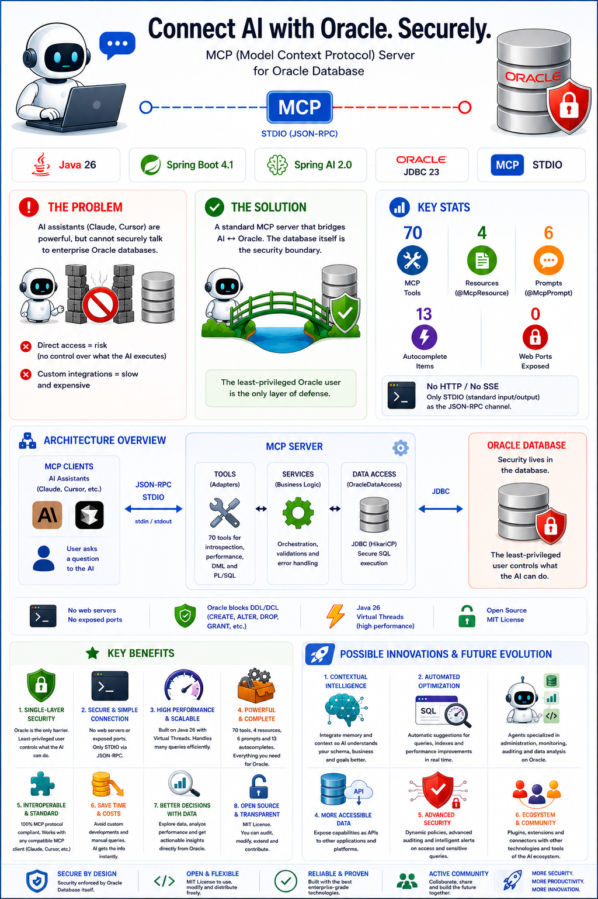
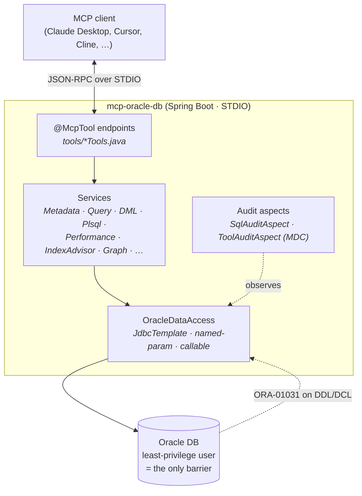

<div align="center">

[English](README.md) | [Español](README.es.md)

# mcp-oracle-db

An [MCP](https://modelcontextprotocol.io) server for **Oracle Database**, built with
Spring Boot and Spring AI.

[](https://opensource.org/licenses/MIT)
[](https://openjdk.org/)
[](https://spring.io/projects/spring-boot)
[](https://spring.io/projects/spring-ai)
[](https://www.oracle.com/database/)
[](https://modelcontextprotocol.io)
[](https://github.com/zademy/mcp-oracle-db/commits/main)
[](https://github.com/zademy/mcp-oracle-db/stargazers)

Let any MCP-compatible client (Claude Desktop, Cursor, Cline, Continue, VS Code,
Windsurf, …) **introspect** an Oracle schema and **run SQL** — safely.

</div>

<p align="center">
  <a href="images/info.png"></a>
</p>

---

## Why mcp-oracle-db?

- **Safe by design** — the only security barrier is a **least-privilege Oracle
  user**. There is no application-layer SQL gate; Oracle itself rejects every
  `CREATE`/`ALTER`/`DROP`/`GRANT`/… with `ORA-01031`.
- **70 tools** across schema introspection, performance diagnostics, index/query
  advisory, data helpers, DML, explain plan, schema graphs, PL/SQL and system.
- **No web port** — STDIO transport only. No HTTP/SSE server is ever exposed.
- **Virtual threads** — Java 26 virtual threads, a natural fit for blocking JDBC.
- **No secrets in the repo** — credentials come from environment variables.

**Who is it for?** DBAs, backend developers and AI-assisted workflows that need a
local, read-heavy Oracle companion: explore a schema, diagnose performance, preview
DML, and let an LLM run ad-hoc SQL without ever risking structural changes.

## What it does

**Executed**

- Schema reads — metadata, DDL source, PL/SQL source, sequences, constraints,
  partitions, performance diagnostics via `V$` views.
- DML — `INSERT`, `UPDATE`, `DELETE`, `MERGE` on existing tables.
- PL/SQL invocation — `call_procedure` (requires `GRANT EXECUTE` on the target).
- Metadata comments — `COMMENT ON ...`.

**Rejected by Oracle** (the least-privilege user has no DDL/DCL privileges)

- All structural DDL — all `CREATE ...` forms, `ALTER`, `DROP`, `TRUNCATE`,
  `RENAME`.
- All DCL — `GRANT`, `REVOKE`, `PURGE`, `FLASHBACK`, `LOCK TABLE`, `AUDIT`,
  `NOAUDIT`, `ANALYZE`.

## Table of contents

- [Why mcp-oracle-db?](#why-mcp-oracle-db)
- [What it does](#what-it-does)
- [Requirements](#requirements)
- [Quickstart](#quickstart)
  - [1. Create the least-privilege Oracle user](#1-create-the-least-privilege-oracle-user)
  - [2. Configure credentials](#2-configure-credentials-environment-variables)
  - [3. Build](#3-build)
  - [4. Connect your MCP client](#4-connect-your-mcp-client-stdio)
  - [Quick first session](#quick-first-session)
- [MCP client configuration](#mcp-client-configuration)
- [Configuration reference](#configuration-reference)
- [SQL audit log](#sql-audit-log)
- [Architecture](#architecture)
- [Tools reference](#tools-reference)
- [Security model](#security-model)
- [Testing](#testing)
- [Troubleshooting and FAQ](#troubleshooting-and-faq)
- [Limitations and notes](#limitations-and-notes)
- [Contributing and agent workflow](#contributing-and-agent-workflow)
- [License](#license)

## Requirements

- **JDK 26**
- **Apache Maven 3.9+** (the included `mvnw` wrapper is enough)
- **Oracle Database 12c+** (tested against 19c / 23ai drivers)
- An **MCP client** that speaks STDIO (Claude Desktop, Cursor, Cline, Continue,
  VS Code, Windsurf, …)

## Quickstart

### 1. Create the least-privilege Oracle user

Run `db/setup_least_privilege_user.sql` as a DBA. Edit the `&` placeholders first.

```bash
# Linux / macOS
sqlplus system/<dba-password>@//<host>:1521/<service> @db/setup_least_privilege_user.sql
```

```cmd
:: Windows (cmd / PowerShell)
sqlplus system/<dba-password>@//<host>:1521/<service> @db\setup_least_privilege_user.sql
```

It creates a user with `CREATE SESSION`, `SELECT_CATALOG_ROLE`, and per-object
`SELECT`/`INSERT`/`UPDATE`/`DELETE` grants on the target schema's tables (plus
`SELECT` on views and sequences). It deliberately grants **no** DDL and **no**
tablespace quota.

### 2. Configure credentials (environment variables)

| Variable             | Meaning                                        | Example                                     |
| -------------------- | ---------------------------------------------- | ------------------------------------------- |
| `ORACLE_DB_URL`      | Thin JDBC URL                                  | `jdbc:oracle:thin:@//db.host:1521/ORCLPDB1` |
| `ORACLE_DB_USERNAME` | Least-privilege user from step 1               | `mcp_user`                                  |
| `ORACLE_DB_PASSWORD` | That user's password                           | `s3cret`                                    |
| `ORACLE_POOL_SIZE`   | HikariCP max pool size (optional, default `7`) | `7`                                         |

> **Which schema does the server use?** There is **no `schema` setting**. In
> Oracle the schema equals the connected user, so the default schema is the
> `ORACLE_DB_USERNAME` you configure. Because the server introspects through the
> `ALL_*` views, it can see **any** schema where that user has grants — pass the
> desired schema name as a tool parameter (e.g. `list_tables(schema="HR")`).
> Which schemas are visible is controlled entirely by the grants in
> `db/setup_least_privilege_user.sql`.

### 3. Build

```bash
# Linux / macOS
./mvnw clean package -DskipTests
```

```powershell
# Windows (PowerShell)
.\mvnw.cmd clean package -DskipTests
```

This produces `target/mcp-oracle-db-0.0.1-SNAPSHOT.jar` (Spring Boot executable jar).

### 4. Connect your MCP client (STDIO)

The JSON shape below is the de-facto standard used by Claude Desktop, Cursor,
Cline, Windsurf and Continue. See [MCP client configuration](#mcp-client-configuration)
for the exact config-file path per client.

```json
{
  "mcpServers": {
    "oracle-db": {
      "command": "/path/to/jdk/bin/java",
      "args": ["-jar", "/absolute/path/mcp-oracle-db-0.0.1-SNAPSHOT.jar"],
      "env": {
        "ORACLE_DB_URL": "jdbc:oracle:thin:@//db.host:1521/ORCLPDB1",
        "ORACLE_DB_USERNAME": "mcp_user",
        "ORACLE_DB_PASSWORD": "s3cret"
      }
    }
  }
}
```

Restart the client after saving. Verify with the `test_connection` tool, which
reports the database version, name, current user, current schema and instance.

### Quick first session

Once the client shows the server connected, try these in order:

1. **`test_connection`** — confirm reachability and the connected user/schema.
2. **`list_tables(schema="HR")`** — see the tables you can access.
3. **`describe_table(schema="HR", table="EMPLOYEES")`** — columns, types, nullability.
4. **`get_sample_data(schema="HR", table="EMPLOYEES")`** — first N rows, no risk.
5. **`run_query(sql="SELECT department_id, COUNT(*) FROM \"HR\".\"EMPLOYEES\" GROUP BY department_id")`**
   — ad-hoc SQL, capped by `max-rows`.

## MCP client configuration

All STDIO clients share the same server block shown in
[step 4](#4-connect-your-mcp-client-stdio). They differ only in **where** that
block is read from:

| Client                    | Config file                                                                                                                     | Key / notes                             |
| ------------------------- | ------------------------------------------------------------------------------------------------------------------------------- | --------------------------------------- |
| **Claude Desktop**        | macOS `~/Library/Application Support/Claude/claude_desktop_config.json` · Windows `%APPDATA%\Claude\claude_desktop_config.json` | `"mcpServers"`                          |
| **Cursor**                | `.cursor/mcp.json` (project) or `~/.cursor/mcp.json` (global)                                                                   | `"mcpServers"`                          |
| **Cline** (VS Code)       | `…/globalStorage/saoudrizwan.claude-dev/settings/cline_mcp_settings.json`                                                       | `"mcpServers"`, set `"disabled": false` |
| **Windsurf**              | `~/.codeium/windsurf/mcp_config.json` (Windows: `%USERPROFILE%\.codeium\windsurf\mcp_config.json`)                              | `"mcpServers"`                          |
| **Continue**              | `~/.continue/config.yaml` (or `.continue/config.json` in the repo)                                                              | `"mcpServers"`                          |
| **VS Code** (MCP, 1.102+) | `.vscode/mcp.json` in the workspace                                                                                             | uses `"servers"` with `"type": "stdio"` |

> Paths can change between client versions — when in doubt, check the client's own
> docs. What matters is that the `command` / `args` / `env` block is identical for
> all of them.

**VS Code note** — its schema uses `servers` instead of `mcpServers`, and each
entry needs `"type": "stdio"`:

```json
{
  "servers": {
    "oracle-db": {
      "type": "stdio",
      "command": "/path/to/jdk/bin/java",
      "args": ["-jar", "/absolute/path/mcp-oracle-db-0.0.1-SNAPSHOT.jar"],
      "env": {
        "ORACLE_DB_URL": "jdbc:oracle:thin:@//db.host:1521/ORCLPDB1",
        "ORACLE_DB_USERNAME": "mcp_user",
        "ORACLE_DB_PASSWORD": "s3cret"
      }
    }
  }
}
```

## Configuration reference

Optional tuning lives in `application.yaml` under `oracle.mcp`:

| Property                | Meaning                               | Default |
| ----------------------- | ------------------------------------- | ------- |
| `max-rows`              | Global cap on rows a `SELECT` returns | `1000`  |
| `query-timeout-seconds` | Per-statement timeout                 | `120`   |
| `default-sample-rows`   | Rows returned by `get_sample_data`    | `10`    |

Logging levels via `LOG_LEVEL` (default `WARN`) and `APP_LOG_LEVEL` (default
`INFO`). Keep in mind that **stdout is the JSON-RPC channel** — logs go to
stderr/file, never stdout.

### SQL audit log

Opt-in per-session SQL audit. When enabled, every SQL statement that reaches
Oracle is appended to a `.txt` file — one file per session.

| Variable            | Meaning                                     | Default            |
| ------------------- | ------------------------------------------- | ------------------ |
| `MCP_AUDIT_ENABLED` | Enable the audit subsystem (`true`/`false`) | `false`            |
| `MCP_AUDIT_DIR`     | Directory for audit log files               | `./mcp-audit-logs` |

#### Enabling in your MCP client

Add the two variables to the `env` block of your MCP server entry — this is the
only place you need to touch. Example for Claude Desktop / Cursor
(`claude_desktop_config.json` or `.cursor/mcp.json`):

```json
{
  "mcpServers": {
    "oracle-db": {
      "command": "/path/to/jdk/bin/java",
      "args": ["-jar", "/absolute/path/mcp-oracle-db-0.0.1-SNAPSHOT.jar"],
      "env": {
        "ORACLE_DB_URL": "jdbc:oracle:thin:@//db.host:1521/ORCLPDB1",
        "ORACLE_DB_USERNAME": "mcp_user",
        "ORACLE_DB_PASSWORD": "s3cret",
        "MCP_AUDIT_ENABLED": "true",
        "MCP_AUDIT_DIR": "/var/log/mcp-oracle-db"
      }
    }
  }
}
```

After saving, **restart the client** so it relaunches the MCP server with the
new environment. One `.txt` per session is then created in `MCP_AUDIT_DIR` and
appended on every SQL the server launches against Oracle.

To validate quickly without the client, run the jar directly:

```bash
# Linux / macOS
MCP_AUDIT_ENABLED=true MCP_AUDIT_DIR=./mcp-audit-logs \
ORACLE_DB_URL=jdbc:oracle:thin:@//host:1521/SVC \
ORACLE_DB_USERNAME=mcp_user ORACLE_DB_PASSWORD=... \
java -jar target/mcp-oracle-db-0.0.1-SNAPSHOT.jar
```

```powershell
# Windows (PowerShell) — set env vars in the same shell, then launch
$env:MCP_AUDIT_ENABLED="true"; $env:MCP_AUDIT_DIR="./mcp-audit-logs"
$env:ORACLE_DB_URL="jdbc:oracle:thin:@//host:1521/SVC"
$env:ORACLE_DB_USERNAME="mcp_user"; $env:ORACLE_DB_PASSWORD="..."
java -jar target/mcp-oracle-db-0.0.1-SNAPSHOT.jar
```

Filename format: `<serverName>-<dd-MM-yyyy>-<sessionId8>-log.txt`.

Each entry records the tool name, parameters, SQL text, outcome, row count and
duration:

```
===== 2026-06-27T14:30:52.884 =====================================
tool     : get_sample_data
params   : schema=HR, table=EMPLOYEES, rows=10
kind     : Select
type     : READ
sql      : SELECT * FROM "HR"."EMPLOYEES" FETCH FIRST 10 ROWS ONLY
outcome  : OK
rows     : 10
duration : 23 ms
-------------------------------------------------------------------
```

**Notes:**

- Audit files contain SQL text **including literals and parameter values** —
  protect the audit directory.
- Disabled by default; zero overhead when off (no files, no I/O).
- STDIO-safe — writes to the filesystem only, never to stdout.

## Architecture

Strict layering. Dependencies point inward (tools → services → persistence).
An audit aspect observes every SQL reaching `OracleDataAccess` without altering
SQL text or results.



## Tools reference

**70 tools**, grouped by category. _Read-only_ never modifies data; _write_
executes on the database.

### Schema introspection _(read-only)_

| Tool                | Description                                                                                                                                                                                                                                                                                            |
| ------------------- | ------------------------------------------------------------------------------------------------------------------------------------------------------------------------------------------------------------------------------------------------------------------------------------------------------ |
| `list_schemas`      | List all Oracle schemas (users) visible to the current connection.                                                                                                                                                                                                                                     |
| `list_tables`       | List tables; optional schema and case-insensitive LIKE name pattern (defaults to `%`).                                                                                                                                                                                                                 |
| `list_views`        | List views; optional schema and LIKE name pattern.                                                                                                                                                                                                                                                     |
| `describe_table`    | Columns of a table: name, data type, nullability, default value and comment. Call before writing SELECT/INSERT/UPDATE against an unverified table.                                                                                                                                                     |
| `list_indexes`      | Indexes on a table with their columns, uniqueness and status.                                                                                                                                                                                                                                          |
| `list_constraints`  | Constraints on a table (PK, FK, unique, check) with columns and references.                                                                                                                                                                                                                            |
| `list_sequences`    | Sequences with range, increment, last number, cycle flag and cache size (from `ALL_SEQUENCES`, not `DBA_SEQUENCES`). Optional schema.                                                                                                                                                                  |
| `get_sequence_info` | Metadata for one sequence (range, increment, last number, cache/order flags) from `ALL_SEQUENCES`. Read-only: does NOT consume `NEXTVAL`.                                                                                                                                                              |
| `table_exists`      | `true` if a table exists (via `ALL_TABLES`; views not considered). Use instead of `run_query {SELECT 1 FROM ALL_TABLES ...}`.                                                                                                                                                                          |
| `list_triggers`     | Triggers with type, triggering event, target table and status. Optional schema.                                                                                                                                                                                                                        |
| `list_objects`      | Database objects; optional schema and object-type filter.                                                                                                                                                                                                                                              |
| `search_objects`    | Search objects by case-insensitive LIKE name pattern; optional type filter.                                                                                                                                                                                                                            |
| `get_ddl`           | DDL of an object via `DBMS_METADATA`. All 3 params required (`schema`, `name`, `type`); read-only. Types: TABLE, VIEW, INDEX, SEQUENCE, PROCEDURE, FUNCTION, PACKAGE, PACKAGE BODY, TRIGGER, TYPE, SYNONYM, DB LINK.                                                                                   |
| `describe_plsql`    | A PL/SQL object: its arguments and full source code.                                                                                                                                                                                                                                                   |
| `call_procedure`    | _(write)_ Execute a PL/SQL procedure, function or package subprogram with typed IN/OUT/INOUT arguments; supports a `SYS_REFCURSOR` OUT/return and function return values. PL/SQL BOOLEAN/RECORD/TABLE/VARRAY/OBJECT are rejected with wrapper guidance. Requires `GRANT EXECUTE` on the target object. |

### Extended introspection _(read-only)_

| Tool                      | Description                                                                        |
| ------------------------- | ---------------------------------------------------------------------------------- |
| `list_materialized_views` | Materialized views with refresh mode, method, last refresh and staleness.          |
| `list_mview_logs`         | Materialized view logs defined on tables. Optional schema.                         |
| `list_synonyms`           | Private and public synonyms with their resolved target and DB link.                |
| `list_partitions`         | Partitions of a partitioned table (name, position, high value, rows, compression). |
| `list_subpartitions`      | Subpartitions of a composite-partitioned table.                                    |
| `list_ind_partitions`     | Partitions of indexes on a table (status, leaf blocks, distinct keys).             |
| `list_db_links`           | Database links visible to the current user.                                        |
| `list_procedures`         | Stored procedures, functions, packages and types; optional filters.                |
| `list_types`              | User-defined types with typecode, attributes, methods and supertype.               |
| `list_dependencies`       | Objects a given object depends on (useful for impact analysis).                    |
| `list_invalid_objects`    | Objects whose status is Invalid (broken code needing recompile).                   |
| `list_external_tables`    | External tables with access driver, directory, reject limit and parameters.        |
| `list_directories`        | Oracle directory objects and their filesystem paths.                               |
| `list_lob_columns`        | LOB columns with segment, caching, SECUREFILE flag and retention.                  |
| `list_scheduler_jobs`     | `DBMS_SCHEDULER` jobs with state, run/failure counts, next run, repeat interval.   |
| `list_scheduler_job_runs` | Recent `DBMS_SCHEDULER` job run details: status, duration, error code.             |

### PL/SQL & optimizer stats _(read-only)_

| Tool                | Description                                                                |
| ------------------- | -------------------------------------------------------------------------- |
| `get_plsql_errors`  | Compilation errors of PL/SQL units. Critical for diagnosing broken code.   |
| `get_table_stats`   | Optimizer stats for a table (rows, blocks, avg row length, last analyzed). |
| `get_column_stats`  | Optimizer stats for columns (NDV, density, nulls, histogram type).         |
| `get_histogram`     | Histogram endpoints for a column (skew and cardinality).                   |
| `get_session_privs` | System privileges of the current connection (direct + via roles).          |
| `get_session_roles` | Roles enabled for the current connection, with admin/default flags.        |

### Performance diagnostics _(read-only, V$ views)_

| Tool                    | Description                                                                     |
| ----------------------- | ------------------------------------------------------------------------------- |
| `list_active_sessions`  | Currently ACTIVE sessions (user, machine, program, elapsed). Optional filters.  |
| `list_blocked_sessions` | Sessions currently blocked, with the blocker and the wait event.                |
| `list_locks`            | DML/transaction/user locks held and requested, with locked object and mode.     |
| `get_session_sql_text`  | Full SQL text being executed by a session (sid, serial#).                       |
| `list_top_sql`          | Top-N SQL ordered by buffer_gets / disk_reads / elapsed / executions / cpu.     |
| `get_wait_events`       | Current wait events from `V$SESSION_WAIT`. Optional sid and wait-class filters. |
| `get_session_longops`   | Long-running operations with progress % and ETA. Optional sid.                  |
| `get_instance_info`     | Instance info: name, host, version, startup time, status.                       |
| `get_database_info`     | Database info: name, log mode, open mode, role, flashback status.               |
| `get_system_stats`      | Cumulative system statistics from `V$SYSSTAT`.                                  |
| `get_db_time_model`     | Time model from `V$SYS_TIME_MODEL` (DB CPU, DB time, parse time).               |
| `get_parameter`         | Initialization parameters from `V$PARAMETER`. Optional name LIKE pattern.       |
| `list_datafile_io`      | Datafiles with size, physical reads/writes and average IO time.                 |

### Index & query advisory _(read-only)_

| Tool                     | Description                                                                                                                                             |
| ------------------------ | ------------------------------------------------------------------------------------------------------------------------------------------------------- |
| `list_unused_indexes`    | Indexes with columns and best-effort usage (`likely_unused` YES/NO/UNKNOWN). A DBA must run `ALTER INDEX ... MONITORING USAGE` for a definitive answer. |
| `suggest_index`          | Analyse SQL via `EXPLAIN PLAN`; propose a `CREATE INDEX` as text (never executed). Apply manually only after DBA review.                                |
| `run_sql_tuning_advisor` | Run `DBMS_SQLTUNE` and return its TEXT report. Requires the `ADVISOR` privilege (see setup script, section 8); otherwise returns guidance.              |

### Data helpers _(read / detect)_

| Tool                      | Description                                                                                                                                                                                    |
| ------------------------- | ---------------------------------------------------------------------------------------------------------------------------------------------------------------------------------------------- |
| `count_rows`              | Total row count of a table — the right tool for this; do NOT use `run_query`. No predicate (no hidden SQL surface). For a filtered count use `run_query` with `SELECT COUNT(*) ... WHERE ...`. |
| `get_next_sequence_value` | `NEXTVAL` of a sequence. **Side-effecting**: advances the counter and the value cannot be reused. When `cache_size` > 0, verify the returned value is not already present in the target table. |
| `validate_fk_integrity`   | Orphan rows violating FK(s) on a table; orphan count per FK (0 = OK).                                                                                                                          |
| `find_duplicates`         | Duplicate rows grouped by columns, with counts. Optional minimum count.                                                                                                                        |
| `find_free_id`            | Smallest free positive id (1..maxRange) not present in a table.column; optional `excludeTable` checks a 2nd table (FK scenarios). Returns `null` if the range is full.                         |

### SQL & data _(executes on the DB)_

| Tool                         | Description                                                                                                                                                                             |
| ---------------------------- | --------------------------------------------------------------------------------------------------------------------------------------------------------------------------------------- |
| `run_query`                  | Run a single `SELECT` (capped by `max-rows`; optional `offset`/`limit` for pagination). `CONNECT BY`/`WITH` (CTE) may be rejected by the parser; prefer `MINUS` or client-side compute. |
| `execute_dml`                | Run a single `INSERT`/`UPDATE`/`DELETE`/`MERGE` and auto-commit; returns rows affected. One statement per call (no PL/SQL blocks, multi-statement, or DDL).                             |
| `execute_dml_preview`        | Non-executing dry-run for `UPDATE`/`DELETE` — row count + sample rows that would be affected.                                                                                           |
| `execute_dml_rollback_first` | Execute the DML inside a transaction that is immediately rolled back; returns the real row count without persisting.                                                                    |
| `get_sample_data`            | Preview the first N rows of a table.                                                                                                                                                    |
| `explain_plan`               | Return the Oracle execution plan via `DBMS_XPLAN`. Needs a `PLAN_TABLE`.                                                                                                                |

### Schema impact graph _(read-only)_

| Tool                   | Description                                                                                     |
| ---------------------- | ----------------------------------------------------------------------------------------------- |
| `get_fk_graph`         | Foreign-key relationships for a schema (or one table) as JSON edges + Mermaid diagram.          |
| `get_dependency_graph` | Object dependency graph (objects that reference or are referenced by a name) as JSON + Mermaid. |

### Metadata comments _(write)_

| Tool                | Description                                       |
| ------------------- | ------------------------------------------------- |
| `comment_on_table`  | Add/replace the comment on a table (own schema).  |
| `comment_on_column` | Add/replace the comment on a column (own schema). |

### System

| Tool                       | Description                                                                                                                                    |
| -------------------------- | ---------------------------------------------------------------------------------------------------------------------------------------------- |
| `test_connection`          | Verify connectivity; report version, name, user, schema and instance.                                                                          |
| `oracle_mcp_health_report` | Five independent readiness probes (connectivity, version, catalog role, invalid objects, server config); aggregate `UP` / `DEGRADED` / `DOWN`. |

### MCP resources _(URI-addressable, read-only)_

| URI                                            | Returns                                                                            |
| ---------------------------------------------- | ---------------------------------------------------------------------------------- |
| `oracle://schema/{schema}/table/{table}`       | Column-level description (name, type, nullability, default, comment).              |
| `oracle://schema/{schema}/object/{object}/ddl` | DDL source (type auto-detected — table, view, package, procedure, etc.).           |
| `oracle://schema/{schema}/plsql/{object}`      | PL/SQL source code.                                                                |
| `oracle://audit/session/{id}`                  | Per-session SQL audit log (`id` = 8-char hex; use `current` for the live session). |

### MCP prompts _(guidance templates)_

| Name                     | Purpose                                                                                                               |
| ------------------------ | --------------------------------------------------------------------------------------------------------------------- |
| `review-sql-performance` | Structured performance review of a SQL statement.                                                                     |
| `explain-schema`         | Guided exploration of an Oracle schema (tables, columns, relationships, key objects).                                 |
| `debug-invalid-plsql`    | Diagnose broken PL/SQL — invalid objects, error codes, source locations.                                              |
| `safe-dml-plan`          | Plan a DML change safely (pre-flight, dry-run, post-execution).                                                       |
| `data-quality-audit`     | Audit data quality (completeness, uniqueness, referential integrity, validity).                                       |
| `oracle-sql-style`       | The server's canonical Oracle SQL authoring rules — prevents common parse errors (ORA-00923/00936/00904/00911/00933). |

### MCP completions _(URI / prompt argument autocompletion)_

13 completions total — schema names (6), table names (3), object names (3), and audit session IDs (1). Limited by the MCP spec to resource URI variables and prompt arguments.

## Security model

Single-layer security: the **least-privilege Oracle user is the only barrier.**
There is no application-layer SQL gate — `SqlGuard` was removed deliberately.
Every statement a tool sends is executed verbatim against Oracle, and Oracle's
privilege model decides allow/deny.

The server connects as a dedicated Oracle user with `CREATE SESSION` +
`SELECT_CATALOG_ROLE` + per-object `SELECT`/`INSERT`/`UPDATE`/`DELETE` grants,
`EXECUTE` on specific procedures and packages (à la carte), and **no** DDL/DCL
privileges or tablespace quota. Any `CREATE`/`ALTER`/`DROP`/`GRANT`/`REVOKE`/
`TRUNCATE`/… returns an Oracle error (typically `ORA-01031: insufficient
privileges`) which surfaces to the client as an explanatory message.

```
 AI SQL  ──▶  OracleDataAccess  ──▶  Oracle (least-priv user)
                     │                       │
                     │              Oracle enforces allow/deny
                     │              (ORA-01031 on DDL/DCL)
                     ▼                       ▼
                result / error string returned to MCP client
```

All internal metadata queries use `ALL_*` views with named parameters
(`:param`). Identifiers are validated and double-quoted (see `SqlIdentifiers`).
One statement per tool call — batches are rejected.

## Testing

The suite is layered so the bulk runs on every commit with **no database
required**, and the live-Oracle path is opt-in.

**Tier 1 — unit + smoke (every `./mvnw test`, no DB).** Tests across
`SqlIdentifiers`, `IndexAdvisor`, `Graph`, `SystemService` health,
`AuditLog` reader + writer, every tool / resource / prompt / completion, plus
`McpOracleDbApplicationSmokeTest` which boots the **full** Spring context on an
in-memory H2 (Oracle-compat) datasource and asserts all 70 `@McpTool` endpoints
register across the 11 tool hosts. Startup regressions (a bad logback config, a
missing bean, a broken auto-config) are caught here.

**Tier 2 — end-to-end MCP STDIO harness (opt-in, needs Oracle).**
`McpStdioE2ETest` spawns the built jar as a subprocess, performs the real MCP
`initialize` handshake, lists tools, and runs SELECT-only checks
(`describe_table`, `run_query`, `count_rows`) over each table you configure,
then asserts Oracle rejects `CREATE TABLE` (insufficient privileges). It is
dual-gated so it never runs by accident:

1. Copy `src/test/resources/application-e2e.example.yaml` to
   `application-e2e.yaml` (gitignored) and fill in the jar path, Oracle
   credentials, schema and a `tables: [...]` array.
2. Run with the `mcp-e2e` profile:

   ```bash
   # Linux / macOS
   ./mvnw test -Pmcp-e2e          # or run-e2e.bat on Windows (builds the jar first)
   ```

   ```powershell
   # Windows (PowerShell)
   .\mvnw.cmd test -Pmcp-e2e
   ```

**Env-gated integration test.** The full context/integration test
(`McpOracleDbApplicationTests.contextLoads`) runs only when `ORACLE_DB_URL` is
set, so `./mvnw test` is green without a database.

```bash
ORACLE_DB_URL=... ORACLE_DB_USERNAME=... ORACLE_DB_PASSWORD=... ./mvnw test
```

## Troubleshooting and FAQ

**`ORA-01031: insufficient privileges` when running `CREATE`/`ALTER`/`DROP`/`GRANT`.**
This is **by design**, not a bug. The least-privilege user has no DDL/DCL
privileges and no tablespace quota, so Oracle rejects the statement. If you
genuinely need structural changes, run them as a DBA — do **not** widen the MCP
user's grants (see [Security model](#security-model)).

**`ORA-12541: TNS:no listener` / `ORA-12514: TNS:listener … service`.** The JDBC
URL in `ORACLE_DB_URL` is wrong or the DB is unreachable. Check the host, port
and service name. Prefer the EZ-connect form
`jdbc:oracle:thin:@//host:1521/SERVICE` (no `tnsnames.ora` needed).

**The client shows the server "failed to start" / no output.** stdout is the
JSON-RPC channel — any stray `System.out` print corrupts framing. The server
disables the Spring banner (`spring.main.banner-mode= off`) for this reason; if
you fork the config, keep it off. Logs go to stderr/file only.

**`explain_plan` returns an Oracle error.** It needs write access to a
`PLAN_TABLE`. Grant it (see the optional line in `db/setup_least_privilege_user.sql`,
section 5) or skip the tool.

**Pool exhaustion / hangs after a DB restart.** HikariCP is configured with
Oracle JDBC socket timeouts (`oracle.jdbc.readTimeout`) precisely to recycle dead
connections. If you override `application.yaml`, keep a read-timeout greater than
`query-timeout-seconds` but below the MCP `request-timeout` (150s).

**Which schema does the server introspect?** There is no `schema` setting — the
default schema is `ORACLE_DB_USERNAME`. Pass any accessible schema as a tool
parameter (e.g. `describe_table(schema="HR", table="EMPLOYEES")`). Visibility is
bounded by the grants in the setup script.

**Can I run multiple SQL statements in one call?** No — one statement per tool
call. Batches, PL/SQL blocks and `;`-chains are rejected. This keeps the
execution model predictable and the connection pool healthy.

## Limitations and notes

- STDIO transport only (local use). No HTTP/SSE server is exposed.
- `explain_plan` needs write access to a `PLAN_TABLE` (see the optional grant in
  the setup script). Without it, that tool returns the Oracle error.
- One statement per tool call — batches are rejected.
- Read access is bounded by what the least-privilege user can see in the `ALL_*`
  views.
- **JSqlParser 4.9 is best-effort only** — it labels DML kind in `DmlService`
  (`INSERT`/`UPDATE`/`DELETE`/`MERGE`, else `UNKNOWN`). It no longer gates
  anything; Oracle is authoritative.
- **Oracle JDBC:** the BOM is `com.oracle.database.jdbc:ojdbc-bom:23.26.2.0.0`.
  `orai18n` is not on Central under that group — it is omitted; `ojdbc17` alone
  works.

## License

[MIT](LICENSE) © Sadot Hdz. Moreno
